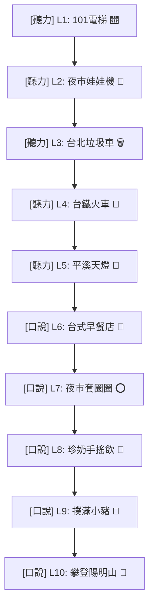

# AI 中文發音練習平台：系統設計與實作計劃書
### Nền Tảng AI Luyện Phát Âm Tiếng Trung
**專為中文舌尖前音與舌尖後音（z, c, s / zh, ch, sh）矯正設計**

*   **設計人 (Designed & Developed by)**: MirandaNguyen
*   **技術規格版本**: v1.5 (2026年6月版)
*   **平台架構**: 響應式 Web 應用程式 (RWD Web App / Platform)
*   **聲學引擎**: 前端網頁 DSP 數位訊號處理 + Web Audio API 訊號擷取 + Z-score 多發音人常模評估演算法

---

## 🌌 一、 設計理念與視覺風格

本平台針對越南籍學生在學習中文「舌尖前音 (z, c, s)」與「舌尖後音 (zh, ch, sh)」時常見的母語負遷移偏誤（例如將翹舌音發為平舌音、送氣不夠充分等），進行聲學物理量化診斷。

*   **VR 科技感視覺**: 背景採用深邃紫黑 (`#0B0B16`) 代表虛擬特訓艙，平舌音以亮青色 (`#22D3EE`) 代表氣流微弱摩擦，翹舌音以電光紫 (`#A78BFA`) 代表舌尖翹起共鳴，打造沉浸式 VR 特訓視覺氛圍。
*   **行動優先 (Mobile-First)**: 自動適應手機與平板尺寸。手機端會切換為「縱向垂直穿梭地景路徑」，所有觸控按鈕大於 44px。
*   **免安裝極速載入**: 不使用任何重型多媒體圖檔，全系統的關卡地圖、遊戲物件與動畫反饋均採用 **CSS 動畫 + Unicode Emojis**，以保障海外學生在不同網路環境下的流暢加載。

---

## 🔒 二、 強制性基本資料登錄閘口 (Profile Gate)

為確保學術研究數據的嚴謹性與可追溯性，學生首次進入系統必須填寫以下基本資料，且進度與個人資訊將綁定於 `localStorage`。當學生點選「切換身分（登出）」時，會**完全清除關卡解鎖進度與本機語音暫存**，以防止下一個測試學生交叉污染數據：

1.  **班級名稱 (Class Name)**: 學生所屬班級（必填）。
2.  **真實姓名 (Full Name)**: 學生英文大寫無聲調姓名（系統會自動將 `Đ` 轉為 `D` 並去除一切越南語聲調，防止檔案系統亂碼）。
3.  **生理性別 (Sex)**: `Nam` (男) 或 `Nữ` (女)，供聲學共振峰常模基準線校正使用。
4.  **國籍 (Nationality)**: 越南 / 臺灣 / 其他。
5.  **越南出生省市 (Province)**: 提供下拉選單。系統背景會自動將越南的 63 個省市映射為三個學術方言區，以利後續分析方言口音影響：
    *   **VietnamNorth (北越)**: 河內市、海防市、太原省、老街省等北部省市。
    *   **VietnamCentral (中越)**: 順化市、峴港市、義安省、多樂省等中部省市。
    *   **VietnamSouth (南越)**: 胡志明市、芹苴市、西寧省、金甌省等南部省市。
6.  **中文程度 (Chinese Level)**: 準備級 (Pre-A1)、入門級 (A1)、基礎級 (A2)、中級 (B1-B2)、高級 (C1-C2)。

---

## 🗝️ 三、 10 關卡全台味遊戲化關卡地圖 (線性解鎖機制)

平台重構為包含 10 個關卡的互動地圖，分為 **5個聽力測驗關卡** 與 **5個口說跟讀關卡**：

### 🎧 聽力測驗關卡 (Levels 1 ~ 5)
1.  **Level 1: 101電梯挑戰** 🛗 (平翹舌音聽辨)
    *   *動畫*: 答對時電梯向上升，答錯時電梯劇烈晃動並伴隨警報紅光。
2.  **Level 2: 夜市娃娃機** 🧸 (送氣音聽辨)
    *   *動畫*: 爪子下降抓取帶有目標字的娃娃，成功時煙火爆發，失敗時娃娃掉落。
3.  **Level 3: 台北垃圾車** 🗑️ (前後鼻音聽辨)
    *   *動畫*: 給予字卡，學生需聽辨丟入「前鼻音-n」或「後鼻音-ng」垃圾桶，答對時垃圾車播放給麗絲音樂前進。
4.  **Level 4: 台鐵環島火車** 🚂 (元音聽辨)
    *   *動畫*: 火車進站，車廂上載有不同元音字母，選對車廂時火車冒煙鳴笛前進。
5.  **Level 5: 平溪天燈祈福** 🏮 (綜合聽力挑戰)
    *   *動畫*: 答對時天燈緩緩升空，寫著學生的答對題數並在夜空中閃爍。

### 🗣️ 口說跟讀關卡 (Levels 6 ~ 10)
6.  **Level 6: 台式早餐店** 🥪 (平翹舌音跟讀)
    *   *動畫*: 跟讀正確時，鐵板上的三明治和蛋餅滋滋作響冒出熱氣，成功配餐。
7.  **Level 7: 夜市套圈圈** ⭕ (送氣音跟讀)
    *   *動畫*: 根據發音準確度決定圈圈飛行的軌跡，分數越高圈圈越準確套中精美獎品。
8.  **Level 8: 珍奶手搖飲** 🧋 (前後鼻音跟讀)
    *   *動畫*: 發音正確時，珍珠和奶茶在杯中瘋狂搖晃混合，並吸入吸管。
9.  **Level 9: 撲滿小豬** 🐖 (元音發音跟讀)
    *   *動畫*: 每次發音成功時，小金幣會伴隨叮噹聲掉入小豬撲滿，小豬會開心地跳動。
10. **Level 10: 攀登陽明山** 🧗 (綜合口說大挑戰)
    *   *動畫*: 學生的小人偶沿著山脊向上攀爬，發音越準爬得越高，登頂時觸發滿版慶祝煙火。

---

## 🔒 四、 「c ch」優先開放與鎖定機制 (研究防干擾設計)

為了配合您的期末展示與目前的發音研究焦點，平台實作了對比單元鎖定：
*   **僅開放「c ch」發音對比**：在 Level 1 和 Level 6 的字卡中，只有涉及 `c` 與 `ch` 的字組與單詞可以被點擊、播放和錄音跟讀。
*   **鎖定「z zh」與「s sh」**：這兩組對比在介面中仍會以灰色半透明字體顯示，但右上角會標註鎖頭圖示（🔒），點擊時會觸發溫和的提示訊息：
    > *Sắp ra mắt! Phần này sẽ được mở vào tháng sau. / 敬請期待！此對比單元即將於下個月開放。*
*   這能有效指引測試學生在特定研究階段內只完成 `c-ch` 測試，保障實驗數據不被其他無關數據干擾。一個月後，僅需修改程式碼中的 `isItemLocked` 規則即可秒級開放。

---

## 🔬 五、 聲學分析核心指標與量化特徵

發音特訓艙之 AI DSP 核心分析模組將針對錄音提取以下物理量進行多维度比對：

### 1. 輔音 (Consonants: z, c, s / zh, ch, sh) 物理量
*   **COG (摩擦重心頻率 - Center of Gravity)**:
    *   發音部位的聲學投影。平舌音 [z, c, s] 因阻礙部位靠前，共鳴腔短，摩擦能量集中在高頻（標準常模約 $6500 \sim 9000 \text{ Hz}$）；翹舌音 [zh, ch, sh] 因阻礙部位靠後，共鳴腔較長，能量集中在中低頻（標準常模約 $3000 \sim 5000 \text{ Hz}$）。
*   **Lower Cutoff Frequency (低頻截止頻率)**:
    *   平舌音一般大於 $5.0 \text{ kHz}$，翹舌音則處於 $2.5 \sim 3.5 \text{ kHz}$ 之間。
*   **VOT (Voice Onset Time / 送氣摩擦時長)**:
    *   送氣音 [c, ch] 在除阻後伴隨強烈的送氣段，VOT 常模約在 $80 \sim 150 \text{ ms}$；不送氣音 [z, zh] 在除阻後隨即振動聲帶，VOT 極短，常模小於 $30 \text{ ms}$。
*   **Spectral Skewness (頻譜偏度)**:
    *   評估頻譜的對稱性，輔助排除越南學生發平翹舌音時舌尖形狀不對稱的偏誤。

### 2. 元音 / 韻母 (Vowels: a, e, i, u, o, ü) 物理量
*   **F1 (第一共振峰)**: 舌位高低 (口張開度)。舌位越低（口張越大，如 `a`），F1 越高（約 $800 \sim 1000 \text{ Hz}$）；舌位越高（如 `i, u`），F1 越低（約 $250 \sim 400 \text{ Hz}$）。
*   **F2 (第二共振峰)**: 舌位前後 (舌伸展度)。前元音（如 `i`）的 F2 很高（約 $2000 \sim 2400 \text{ Hz}$）；後元音（如 `u`）的 F2 很低（約 $600 \sim 900 \text{ Hz}$）。
*   **F3 (第三共振峰)**: 圓唇度與捲舌度。發圓唇音時 F3 下降；發翹舌元音時 F3 急劇下跌。
*   **Pitch F0 Contour (音高基頻軌跡)**: 比對聲調是否標準，特別是針對越南學生容易混淆的二聲與四聲進行動態時間規整 (DTW) 比對。

### 3. 鼻音韻尾 (Codas: -n / -ng) 物理量
*   **F2 Locus (終端過渡頻率)**: 前鼻音 [-n] 結尾時，舌尖抵住齒齦，使 F2 終端強烈向上攀升至 $\approx 1800 \text{ Hz}$。
*   **F2-F3 Pinching (齶部緊縮)**: 後鼻音 [-ng] 結尾時，舌根升起抵住軟腭，聲學上呈現 F2 上升、F3 下降，兩者在結尾處距離小於 $300 \text{ Hz}$。
*   **Anti-formant (反共振峰低谷)**: 鼻音化段在 $500 \sim 1500 \text{ Hz}$ 之間會出現顯著的共振波谷（鼻通道吸收能量）。

---

## 📈 六、 多發音人常模評分演算法

平台實作了可擴充的 **多發音人常模參考系統 (Multi-Speaker Norm Reference)**：

1.  **教師錄製與建檔**：教師進入後台（輸入密碼 `teacher888`），可切換 Speaker 1 至 Speaker 5 不同的錄製插槽。對 20 個核心對比字詞進行錄製建檔。
2.  **平均值與標準差計算**：系統會自動對多位台灣發音人錄下的參數 $X_{speaker}$ 取平均數 $Mean$ 與標準差 $SD$：
    $$Mean_i = \frac{1}{N}\sum_{k=1}^N S_{ik}$$
    $$SD_i = \sqrt{\frac{1}{N-1}\sum_{k=1}^N (S_{ik} - Mean_i)^2}$$
3.  **學生評分公式**：
    學生發音時，系統提取其參數 $S_{student}$ 並與常模比對：
    $$Score = 100 - \sum \left( w_i \times \frac{|S_{student, i} - Mean_i|}{SD_i} \right)$$
    *   *權重分配 ($w_i$)*: COG (35%)、VOT (35%)、Cutoff (20%)、偏度 (10%)。
    *   若學生參數落在常模的 $Mean \pm 1.2 SD$ 之內，發音分數即可突破 90分 以上並解鎖黃金皇冠 👑 特效。
    *   *學術理論預設常模 (Fallback)*: 若教師尚未在後台錄製完成 3 位台灣發音人的音檔，評分系統會自動載入學術文獻中的「標準語音學理論預設常模」，確保平台隨時可用。

---

## 📂 七、 學術級 WAV 導出命名規則

為利於將學生音檔匯入 Praat 等語音分析軟體中進行人工聲學比對與統計，學生和教師在點選下載 WAV 時，系統將按照以下格式自動重命名檔案：

$$\text{[CollectionNumber]\_[ChineseCharacter]\_[StudentName]\_[NationalityRegion]\_[ChineseLevel]\_[Gender].wav}$$

*   **CollectionNumber (收集次數/序號)**: 從 `01` 開始遞增。
*   **ChineseCharacter (練習國字)**: 例如 `餐`、`產`。
*   **StudentName (大寫無聲調姓名)**: 例如 `NGUYEN VAN AN`。
*   **NationalityRegion (國籍與方言區)**: 例如 `VietnamSouth`、`Taiwan`。
*   **ChineseLevel (中文程度)**: `PreA1`、`A1`、`A2`、`B1`、`C1`。
*   **Gender (生理性別)**: `M` (男) 或 `F` (女)。
*   *命名示例*: `01_餐_NGUYEN VAN AN_VietnamSouth_A2_M.wav`
